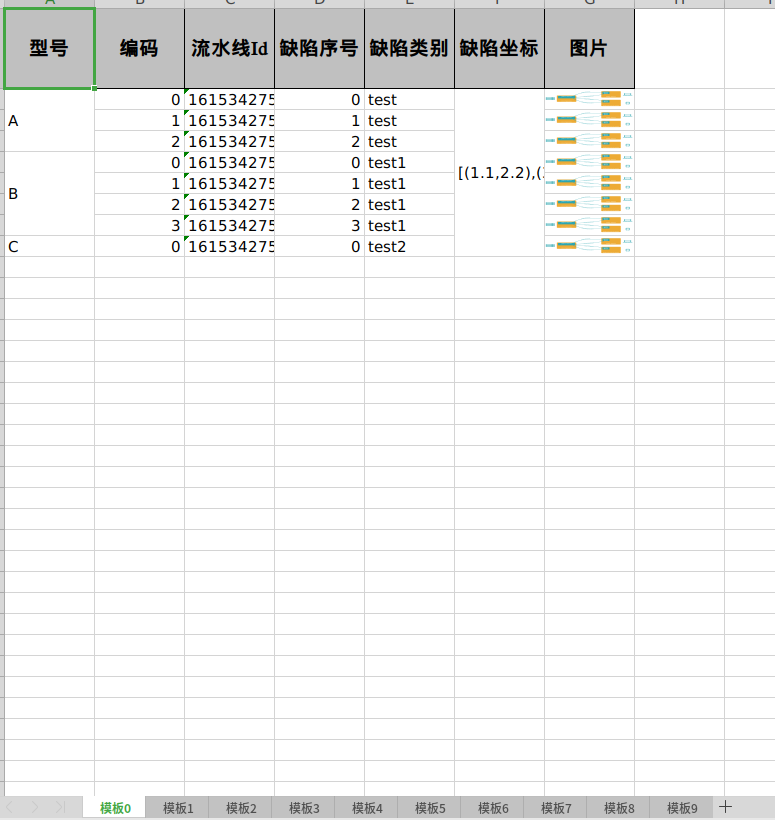

# EasyExcelPlus

> EasyExcelPlus是基于EasyExcel的，在原有的基础上加强了部分功能。  
> 如需更多的功能，欢迎PR或者Issues

####运行环境
Java：JDK11 
---

### 功能
- 合并列中的相同的值（支持多列）
---

#### 使用须知
+ @MergeModel：表示合并模式（目前支持合并列中的重复值）
+ @CellMerge：表示单元格合并模式
---

#### 使用例子（具体可见test中的例子）

`以下为要写入到Excel中类`
```java
@Data
@HeadRowHeight(60)
@MergeModel
public class PartsData {
    @ExcelProperty(value = "型号")
    @CellMerge
    private String partsCategory;


    @ExcelProperty(value = "编码")
    private int code;

    @ExcelProperty(value = "流水线Id")
    private String pipelineId;

    @ExcelProperty(value = "缺陷序号")
    private int num;

    @ExcelProperty(value = "缺陷类别")
    private String flawCategory;

    @ExcelProperty(value = "缺陷坐标")
    @CellMerge
    private String coordinate;

    @ExcelProperty(value = "图片")
    private byte[] byteArray;
}
```

`具体写入的方法`
```java
@Test
public void simpleWriteTest() {
    List<PartsData> data = PartsData.buildList();
    String fileName = new Date() + "_simple.xlsx";
    EasyExcelPlus.write(fileName, data, PartsData.class, 10);
}
```

#### 结果如下图



